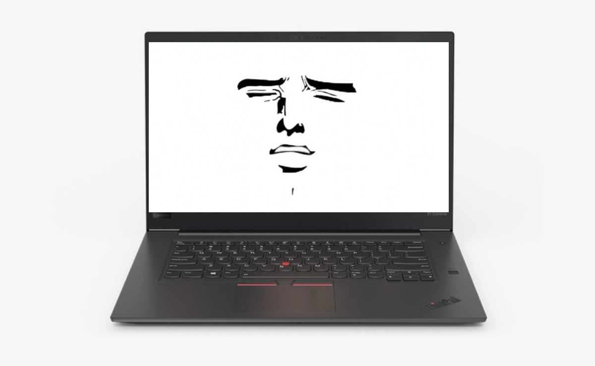

# Nub Moan



Source code for nubmoan, the program that makes your ThinkPad TrackPoint (the red nub) moan when you press it.

Record your own moans and include them in the `/moanswav` folder in increasing intensity from 1-10 as `file1.wav` `file2.wav` and so on.

## Quick Start

### Prerequisite

- Change `ABSOLUTE_PATH_TO_WAV_FOLDER` constant in `mouse_tracker.c`
- [winget](https://apps.microsoft.com/detail/9nblggh4nns1)
- [clang](#clang-installation)

### Clang Installation

```powershell
winget install --id LLVM.LLVM
# After installation (if not set automatically)
# Go to environment variables and add `C:\Program Files\LLVM\bin` to PATH
```

### Compilation & Run

```powershell
clang.exe mouse_tracker.c -lUser32.lib -lWinmm.lib -o mouse_tracker.exe
```
